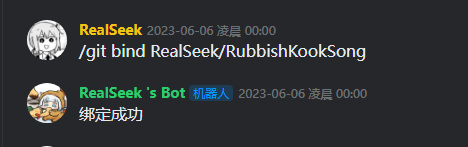
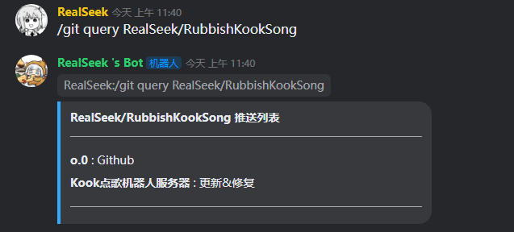
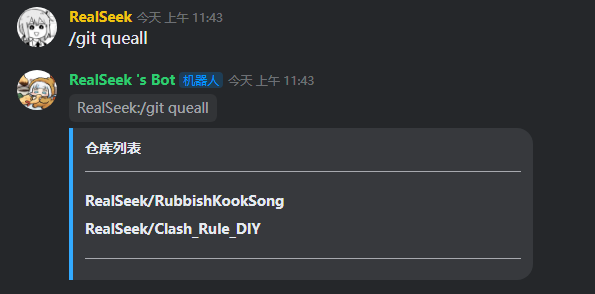
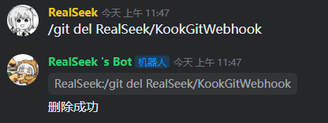
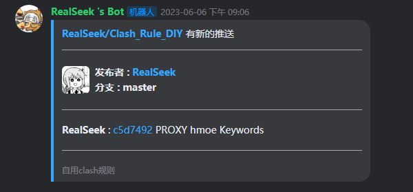

<h1 align="center">
  KookGitWebhook
</h1>

<p align='center'>
    <a  href="https://www.oracle.com/java/technologies/javase/javase-jdk8-downloads.html">
		
	</a>
    <a  href="https://github.com/SNWCreations/JKook">
		
	</a>
    <a href="https://github.com/SNWCreations/KookBC">
        
    </a>
    <a href="https://opensource.org/licenses/MIT">
        
    </a>
    <a href="https://www.codefactor.io/repository/github/realseek/rubbishkooksong">
    </a>
</p>

## 使用说明

本插件会在本地创建一个http服务器,端口可以在配置文件内修改,插件内所有功能只有插件管理员可以使用

## 配置文件

```bash
# HTTP 服务器端口
port: 25565

# url 路径配置
url_parameter: ""

# 插件管理员ID
BotAdmin: ["2038278961", "管理员ID"]
```

## 指令

`/git bind User/repo` 作用:绑定一个 repo 到频道内,触发 webhook 后会在绑定的频道推送。例如: /git bind RealSeek/KookGitWebhook



`/git query User/repo` 作用:查询一个 repo 绑定了多少个服务器频道 例如: /git query RealSeek/KookGitWebhook



`/git queall` 作用:查询 Bot 绑定了多少个 repo 例如: /git queall



`/git del User/repo` 作用:删除一个 repo 的推送 例如: /git del RealSeek/KookGitWebhook



## 推送样式



